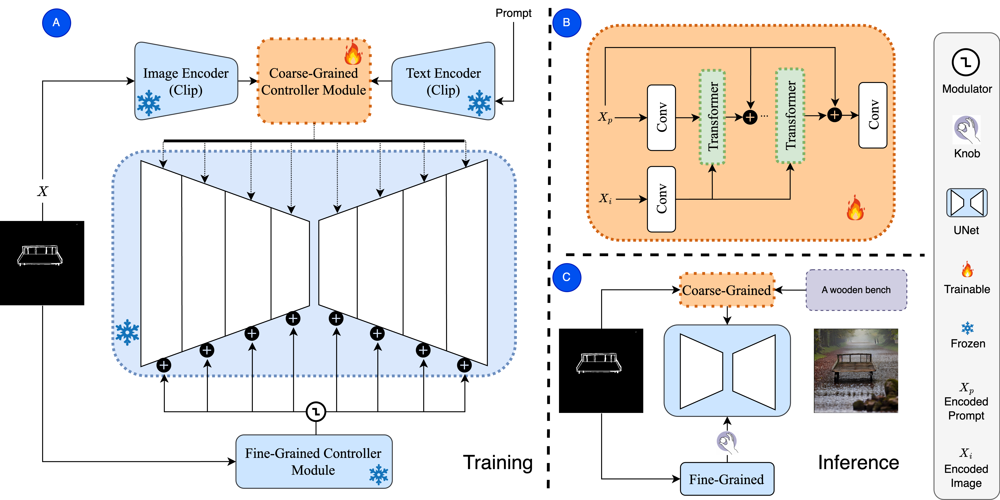

# KnobGen: Controlling the Sophistication of Artwork in Sketch-Based Diffusion Models

KnobGen for Condition Diffusion Tasks ([Pouyan Navard*](https://www.linkedin.com/in/pouyan-boreshnavard/), [Amin Karimi Monsefi*](https://7amin.github.io/), [Mengxi Zhou](https://www.linkedin.com/in/mengxi-zhou-23a10b289/), [Wei-Lun (Harry) Chao](https://sites.google.com/view/wei-lun-harry-chao/home), [Alper Yilmaz](https://ceg.osu.edu/people/yilmaz.15), [Rajiv Ramnath](https://cse.osu.edu/people/ramnath.6))

Paper Link: [KnobGen: Controlling the Sophistication of Artwork in Sketch-Based Diffusion Models](https://arxiv.org/abs/2410.01595)

\* These authors contributed equally to this work. 

KnobGen, a dual-pathway framework that democratizes sketch-based image generation by seamlessly adapting to varying levels of sketch complexity and user skill. KnobGen employs a Coarse-Grained Controller (CGC) module for leveraging high-level semantics from both textual and sketch inputs in the early stages of generation, and a Fine-Grained Controller (FGC) module for detailed refinement later in the process.

# News

- [2024-09-27] 🔥 Initial release of KnobGen code!
- [2024-10-02] 🔥 The paper is released on arXiv.

# Installation
To set up the environment and start using KnobGen, please follow these steps:

1. `conda env create -f environment.yml`
2. `conda activate knobgen`

# Results

 Our method democratizes sketch-based image generation by effectively handling a broad spectrum of sketch complexity and user drawing ability—from novice sketches to those made by seasoned artists—while maintaining the natural appearance of the image.

### KnobGen vs. baseline on novice sketches

### Impact of the knob mechanism across varying sketch complexities

