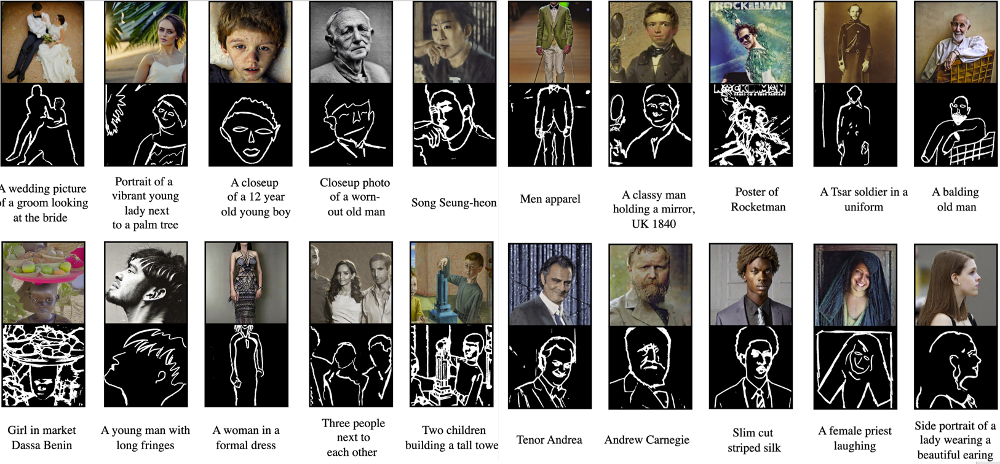
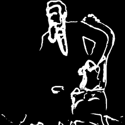
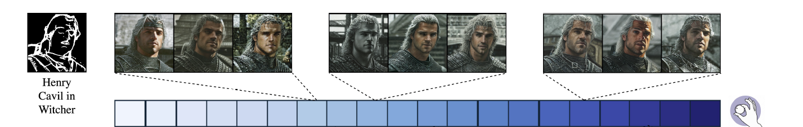

# KnobGen
## Controlling the Sophistication of Artwork in Sketch-Based Diffusion Models

KnobGen is a dual-pathway framework that empowers sketch-based image generation diffusion model by seamlessly adapting to varying levels of sketch complexity and user skill. KnobGen employs a Coarse-Grained Controller (CGC) module for leveraging high-level semantics from both textual and sketch inputs in the early stages of generation, and a Fine-Grained Controller (FGC) module for detailed refinement later in the process. 


More details available in our [paper](https://arxiv.org/abs/2410.01595).

## Quick Demo

## :rocket: News
- [2024-09-27] 🔥 Initial release of KnobGen code!
- [2024-10-02] 🔥 The paper is released on arXiv.

## Table of Contents
Follow steps 1-3 to run our pipeline. 
1. [Installation](#Installation)
2. [Prepare the Dataset](#Prepare-the-Dataset)
3. [Train](#Train)
4. [Inference](#inference)
5. [Results](#Results)

## Installation
To set up the environment, please follow these steps in the terminal:
```shell
git clone https://github.com/aminK8/KnobGen.git
cd KnobGen
conda env create -f environment.yml
conda activate knobgen
```

## Prepare the Dataset
To setup the dataset follow these steps:
## Train
To train the model follow thes steps:

## Inference
To run inference follow thes steps:

## Results

 Our method democratizes sketch-based image generation by effectively handling a broad spectrum of sketch complexity and user drawing ability—from novice sketches to those made by seasoned artists—while maintaining the natural appearance of the image.

<p align="center">
  <table>
    <tr>
      <td align="center">
        <br>
        <b>More demos</b> 
      </td>
      <td align="center">
        <br>
        <b>Comparison With Baseline</b> 
      </td>
    </tr>
  </table>
</p>

<p align="center">
  <br>
  <em> The effect of our <b>Knob</b> mechanism<em>
</p>


## Citation
If you liked our paper, please consider citing it
```bibtex
@misc{navardknobgen,
      title={KnobGen: Controlling the Sophistication of Artwork in Sketch-Based Diffusion Models}, 
      author={Pouyan Navard and Amin Karimi Monsefi and Mengxi Zhou and Wei-Lun Chao and Alper Yilmaz and Rajiv Ramnath},
      year={2024},
      eprint={2410.01595},
      archivePrefix={arXiv},
      primaryClass={cs.CV},
      url={https://arxiv.org/abs/2410.01595}, 
}
```
